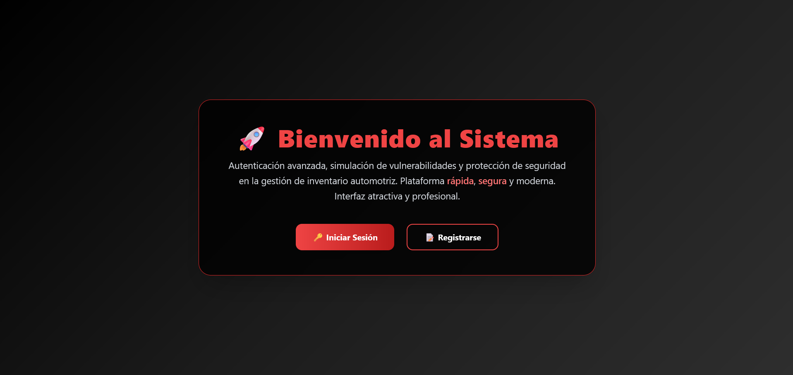
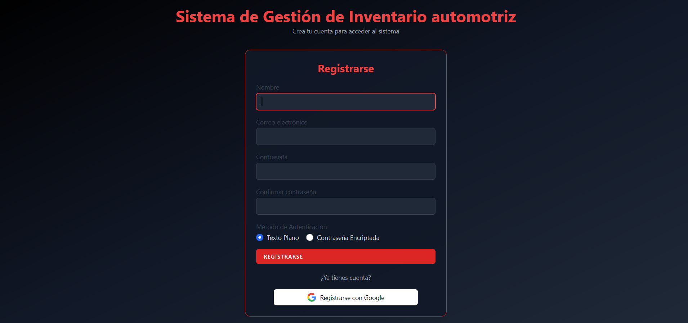
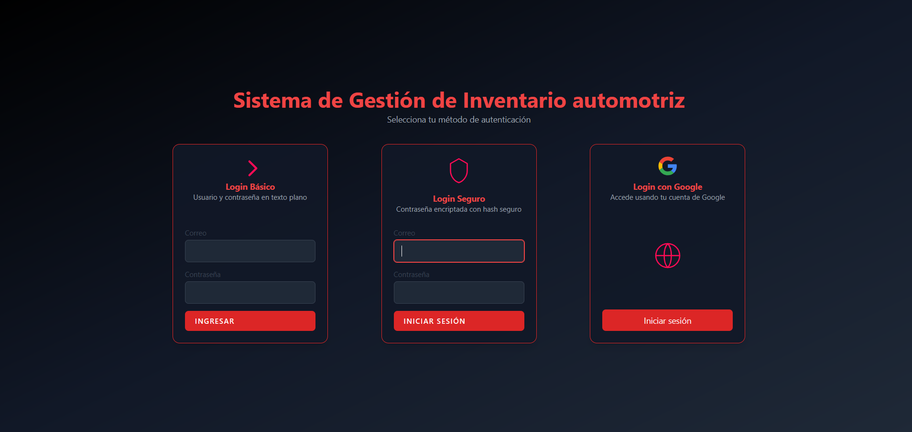
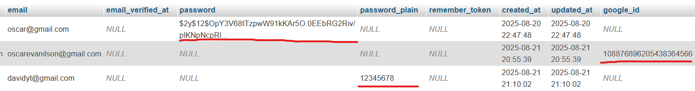

# 🚗 Sistema de Autenticación con Gestión de Inventario Automotriz

## 📌 Descripción del Proyecto
Este proyecto consiste en el desarrollo de un sistema que implementa diferentes **métodos de autenticación** bajo una arquitectura **cliente-servidor**, en el contexto de la gestión de un **inventario automotriz**.  
El objetivo es **simular vulnerabilidades de seguridad** y aplicar **técnicas de protección** para reforzar la seguridad en aplicaciones reales.  

---

## 🔐 Métodos de Autenticación Implementados
El sistema incluye **tres métodos de autenticación**:

1. **Login con contraseñas planas (no encriptadas)**  
   - Ejemplo de mala práctica de seguridad.  
   - Se utiliza para mostrar cómo las contraseñas almacenadas sin protección son vulnerables a ataques.  

2. **Login con contraseñas encriptadas con Bcrypt**  
   - Laravel incluye por defecto el **algoritmo bcrypt** para el hashing de contraseñas.  
   - Este método demuestra las **mejores prácticas** para proteger credenciales.  

3. **Inicio de sesión con Google (OAuth 2.0)**  
   - Se implementa utilizando **Laravel Socialite**.  
   - Permite autenticación mediante cuentas externas de Google, agregando un nivel adicional de seguridad y comodidad para el usuario.  

---

## 🛠️ Tecnologías Implementadas
- **Framework Backend:** Laravel 12
- **Lenguaje de programación:** PHP 8.2+  
- **Base de datos:** MySQL  
- **Frontend:** Blade + Bootstrap  
- **Servidor Web:** Apache  

---

## 📚 Librerías o Frameworks Empleados
- [Laravel](https://laravel.com/) → Framework principal.  
- [Laravel UI](https://github.com/laravel/ui) → Login básico y registro.  
- [Laravel Socialite](https://laravel.com/docs/socialite) → Autenticación con Google OAuth.  
- [Bootstrap 5](https://getbootstrap.com/) → Estilos y diseño responsivo.  

---

## 🗄️ Sistema de Gestión de Base de Datos
- **Motor:** MySQL  
- **Herramienta de administración:** phpMyAdmin

---

## 🔒 Herramientas de Cifrado Utilizadas
- **Contraseñas planas:** sin cifrado (para demostrar vulnerabilidad).  
- **Bcrypt:** hashing de contraseñas con el método por defecto de Laravel.  
- **Google OAuth 2.0:** autenticación delegada mediante tokens seguros.  

---

## 🖼️ Capturas de Pantalla

 **Pantalla de inicio**  
   

- **Pantalla de registro con las tres opciones para registrarse**  
    

- **Pantalla de login con las tres opciones de inicio de sesion**  
    

- **Base de datos donde podemos ver como se almacenan las 3 forma de iniciar sesion**  
 **Encriptada, plano y con google**  
    

